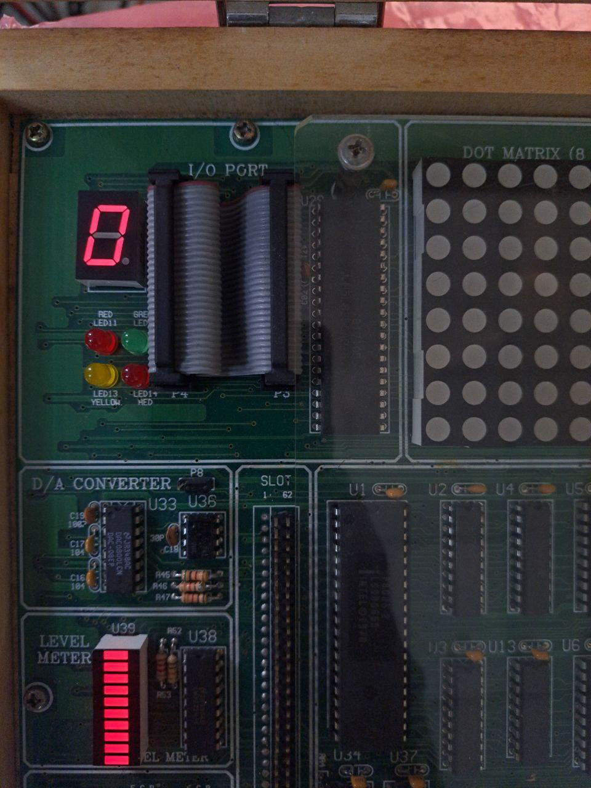
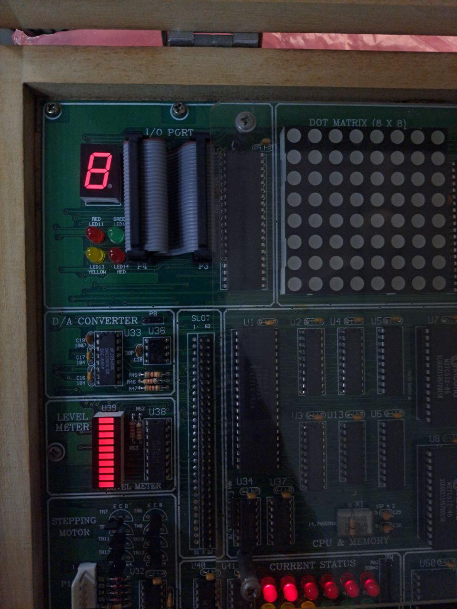
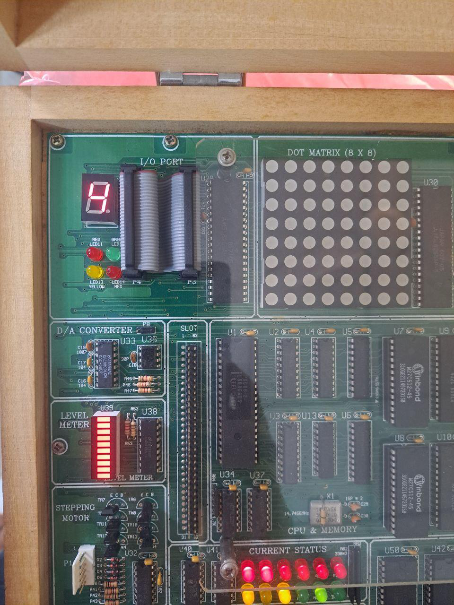
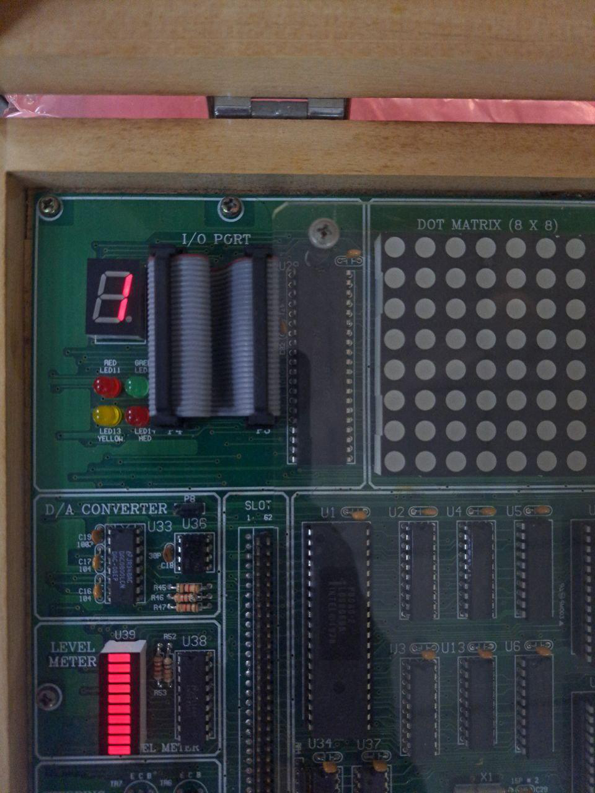

## **8086-8255A Seven Segment Display Interfacing**

## **Project Overview**

This project demonstrates the interfacing of an 8086 microprocessor with a 7-segment display using the 8255A Programmable Peripheral Interface. The main goal is to understand how the 8086 communicates with peripheral devices and how control words are generated to perform output operations through the 8255A.

The experiment displays numerical digits from 0 to 9 on a 7-segment display using assembly-level programming and delay routines.

## **Objectives**
1. To understand the interfacing of the 8086 microprocessor with peripherals using the 8255A PPI.
2. To learn the process of generating control words for the 8255A.
3. To display numbers from 0 to 9 on a 7-segment display.
4. To observe the output behavior of a 7-segment display in a microprocessor-based system.

## **Required Apparatus and Software**

1. MDA8086 Microprocessor Kit
2. 8255A Programmable Peripheral Interface
3. 7-Segment Display
4. Notepad or any text editor
5. Assembly language tools or compatible 8086 development environment

## **Codes**


```asm
CODE    SEGMENT
        ASSUME  CS:CODE,DS:CODE,ES:CODE,SS:CODE
;
PPIC_C  EQU     1FH
PPIA    EQU     19H
;
        ORG     1000H
        MOV     AL,10000000B
        OUT     PPIC_C,AL
;
L2:     MOV     SI,OFFSET DATA
L1:     MOV     AL,BYTE PTR DS:[SI]
        CMP     AL,00H
        JE      L2
        OUT     PPIA,AL
        CALL    TIMER
        INC     SI
        JMP     L1
;
        INT     3
;
TIMER:  MOV     CX,0FFFFH
TIMER1: NOP
        NOP
        NOP
        LOOP    TIMER1
        RET
;
DATA:   DB      11111001B
        DB      10000000B
        DB      11000000B
        DB      11111001B
        DB      11111001B
        DB      10100100B
        DB      10110000B
        DB      00H
CODE    ENDS
        END
```

## **Output**

The output of this experiment shows the successful interfacing of the 8086 microprocessor with a 7-segment display using the 8255A Programmable Peripheral Interface. The display changes according to the binary data sent from the assembly program.

The following figures show the observed output on the 7-segment display.

### **Figure 1: 7-Segment Display Output for Initial Display State**


This figure shows the observed output of the 7-segment display after running the assembly program using the 8086 microprocessor and 8255A Programmable Peripheral Interface.

### **Figure 2: 7-Segment Display Output During Sequential Digit Display**



This figure shows one of the intermediate display states where the 7-segment display changes according to the binary pattern sent through the 8255A interface.


### **Figure 3: 7-Segment Display Output for Next Digit Pattern**



This output represents another digit pattern generated by the assembly program. The 8086 sends the corresponding data to the 7-segment display through the 8255A PPI.


### **Figure 4: 7-Segment Display Output Showing Continued Operation**



This figure confirms that the program continues to send data patterns sequentially, allowing the display to change from one digit to another.


### **Figure 5: Final Observed 7-Segment Display Output**



This figure shows the final observed output condition of the 7-segment display during the experiment.


## **Output Observation**

From the output images, it is observed that the 7-segment display responds correctly to the data provided by the 8086 microprocessor through the 8255A Programmable Peripheral Interface. The program sends different binary values to the output port, and each value activates a specific combination of LED segments.

The delay routine in the assembly program allows each digit or segment pattern to remain visible for a short time before moving to the next output state.

## **Result**

The experiment was successfully performed. The 8086 microprocessor was able to interface with the 7-segment display using the 8255A PPI, and the desired output patterns were displayed correctly.
